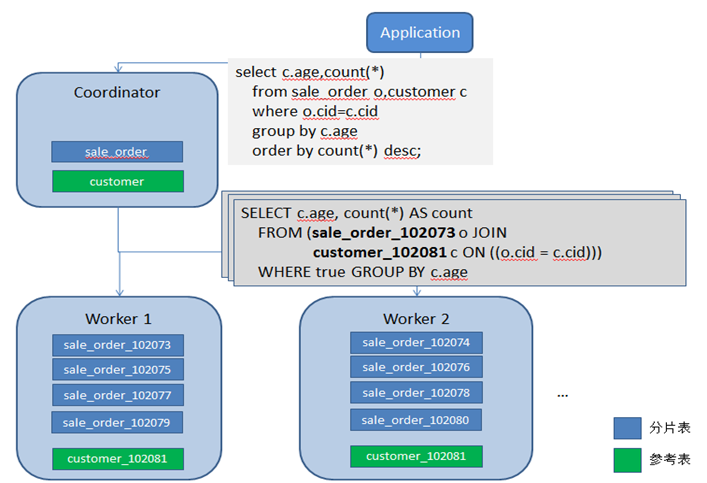
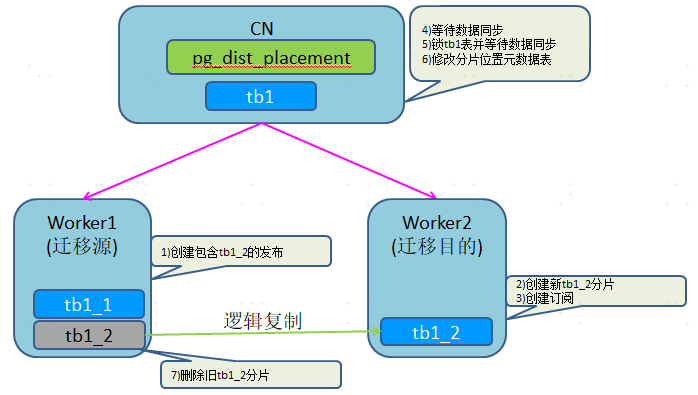
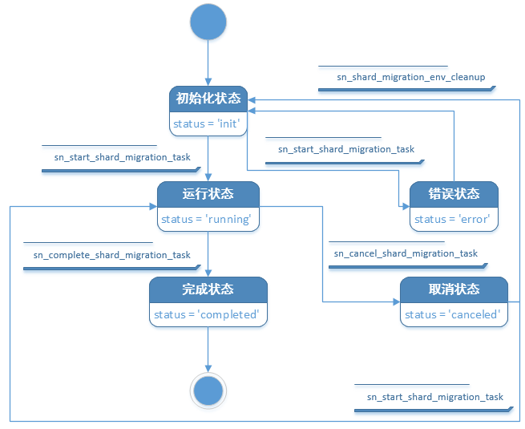

cigration是一个由一系列工具函数组成的PostgreSQL扩展，主要用于执行Citus的在线分片迁移，可用于Citus集群扩容和缩容场景。cigration是`Citus` + `migration`的拼写。当前cigration处于beta阶段。


## 1. 使用场景

Citus的分片表由CN上的一个逻辑表和分布在各个Worker上的若干分片组成，当进行集群扩缩容等操作时，可以通过迁移分片来实现。



具体支持的场景和操作步骤如下

### 1.1 扩容

1. 添加新的worker节点到Citus集群

2. 从既有worker节点迁移部分分片到新worker节点，实现分片部署均衡

### 1.2 缩容

 	1. 从将被缩容掉的Worker迁出分片
 	2. 从Citus集群删除Worker

### 1.3 Worker节点替换

当需要用新机器替换掉某个Worker时，也可以通过迁移分片实现。比如某个Worker节点的机器故障频发需要替换。

1. 添加新的worker节点到Citus集群
2. 把准备下线的Worker节点上所有分片都迁移到新加入的Worker
3. 从Citus集群删除准备下线的Worker


## 2. 技术原理

cigration的主要功能就是在Citus Worker节点间在线迁移分片，迁移过程中产生的更新通过逻辑订阅机制进行同步。单个分片的迁移过程如下



为了确保迁移不破坏分片表的亲和关系，互相亲和的一组分片需要同时迁移。

另外，对一次扩容或者缩容作业，需要迁移大量分片，如果人工一个分片一个分片迁移是非常繁琐的，cigration简化了这些操作。迁移时首先会对一个扩容或者缩容作业生成所需的若干迁移任务，每个迁移任务是最小的分片迁移单位，包含一组互相亲和的分片。然后通过调度这些迁移任务最终完成扩容或者缩容作业。

迁移过程中，每个分片迁移任务的状态变化如下所示



注：上的`sn_`前缀实际应该是`cigration_`前缀

对于中途出错的任务，可以通过调用函数`cigration_shard_migration_env_cleanup()`，将其变回到初始的init状态，再继续执行。


## 3.  环境依赖

cigration依赖以下环境条件

- PostgreSQL10+

- Citus 9.2+
- dblink
- Citus CN节点可免密访问Worker节点


## 4. 插件安装

在Citus的CN节点安装Citus分片迁移工具插件

```
git clone https://github.com/cloud-sn2/cigration
cd cigration
make install
```

执行`make install`时需要确保PATH路径中包含PostgreSQL安装路径，并拥有安装文件权限，比如使用下面形式。

```
sudo PATH=/usr/pgsql-12/bin:$PATH make install
```

也可以通过拷贝文件的方式安装,比如

```
cp cigration.control cigration--*.sql /usr/pgsql-12/share/extension/
```

连接CN节点安装cigration扩展

```
create extension if not exists dblink;

SET citus.enable_ddl_propagation TO off;
create extension cigration;
RESET citus.enable_ddl_propagation;
```

**注意**

安装完cigration之后，原来Citus中的`create_distributed_table()`将无法继续使用，需要替换成`cigration.cigration_create_distributed_table()`。


## 5. 操作示例

下面以扩容Worker节点为例进行介绍cigration的使用方法。

### 5.1 环境准备

扩容前，Citus集群包含以下2个worker节点。

- worker1:5432
- worker2:5432

假设数据库中，包含下面2个互相亲和的分片表

```
create table tb1(c1 int primary key, c2 int);
create table tb2(c1 int primary key, c2 int);

set citus.shard_count=8;
select cigration.cigration_create_distributed_table('tb1','c1','none');
select cigration.cigration_create_distributed_table('tb2','c1','tb1');

insert into tb1 select generate_series(1,100000), 0;
insert into tb2 select generate_series(1,100000), 0;
```

扩容前，所有分片均匀的分布在2个worker上，如下

```
postgres=# select pg_dist_shard.logicalrelid,
       pg_dist_shard_placement.nodename,
       pg_dist_shard_placement.nodeport,
       pg_dist_shard_placement.shardid
from pg_dist_shard_placement,pg_dist_shard
where pg_dist_shard_placement.shardid=pg_dist_shard.shardid and pg_dist_shard.logicalrelid::text = 'tb1'
order by pg_dist_shard.logicalrelid, pg_dist_shard_placement.shardid;
 logicalrelid | nodename | nodeport | shardid
--------------+----------+----------+---------
 tb1          | worker1  |     5432 |  102708
 tb1          | worker2  |     5432 |  102709
 tb1          | worker1  |     5432 |  102710
 tb1          | worker2  |     5432 |  102711
 tb1          | worker1  |     5432 |  102712
 tb1          | worker2  |     5432 |  102713
 tb1          | worker1  |     5432 |  102714
 tb1          | worker2  |     5432 |  102715
(8 rows)
```

### 5.2 添加worker

添加一个新的worker到集群中

```
select master_add_node('worker3',5432);
```

### 5.3 创建一个再平衡作业

新worker节点加入Citus集群后，已有的分片并不会自动部署上去，即此时Citus集群中的分片部署是不均衡的。可以创建一个分片再平衡的作业。

```
select * from cigration.cigration_create_rebalance_job();
```

函数返回生成的迁移作业的jobid和这个作业包含的迁移任务，如下

```
 jobid | taskid | all_colocateion_shards_id | source_worker | target_worker | total_shard_count | total_shard_size
-------+--------+---------------------------+---------------+---------------+-------------------+------------------
     1 |      1 | {102714,102722}           | worker1       | worker3       |                 2 |           917504
     1 |      2 | {102715,102723}           | worker2       | worker3       |                 2 |           917504
(2 rows)
```

查看生成的job

```
select jobid, taskid, source_nodename, source_nodeport, target_nodename, target_nodeport, status, all_colocateion_shards_id, all_colocateion_shards_size, total_shard_count, total_shard_size, error_message from cigration.pg_citus_shard_migration order by jobid,taskid;
```

这个job包含2分分片迁移任务

```
-[ RECORD 1 ]---------------+----------------
jobid                       | 12
taskid                      | 8
source_nodename             | worker1
source_nodeport             | 5432
target_nodename             | worker3
target_nodeport             | 5432
status                      | init
all_colocateion_shards_id   | {102714,102722}
all_colocateion_shards_size | {458752,458752}
total_shard_count           | 2
total_shard_size            | 917504
error_message               |
-[ RECORD 2 ]---------------+----------------
jobid                       | 12
taskid                      | 9
source_nodename             | worker2
source_nodeport             | 5432
target_nodename             | worker3
target_nodeport             | 5432
status                      | init
all_colocateion_shards_id   | {102715,102723}
all_colocateion_shards_size | {458752,458752}
total_shard_count           | 2
total_shard_size            | 917504
error_message               |
```

### 5.4 执行迁移作业

代入前面生成的作业的jobid，执行迁移作业

```
select cigration.cigration_batch_run_migration_tasks(1);
```

函数执行过程中会实时输出迁移进度

```
NOTICE:  2021-01-15 00:05:11.851703+08 [1/2] migration task 1 completed. (processed/total/percent: 896 kB/1792 kB/50 %)
NOTICE:  2021-01-15 00:05:19.732616+08 [2/2] migration task 2 completed. (processed/total/percent: 1792 kB/1792 kB/100 %)
 cigration_batch_run_migration_tasks
-------------------------------------
 t
(1 row)
```

迁移作业完成后，再次查看分片位置，分片已经部署到新加的worker上了。

```
postgres=# select pg_dist_shard.logicalrelid,
       pg_dist_shard_placement.nodename,
       pg_dist_shard_placement.nodeport,
       pg_dist_shard_placement.shardid
from pg_dist_shard_placement,pg_dist_shard
where pg_dist_shard_placement.shardid=pg_dist_shard.shardid and pg_dist_shard.logicalrelid::text = 'tb1'
order by pg_dist_shard.logicalrelid, pg_dist_shard_placement.shardid;
 logicalrelid | nodename | nodeport | shardid
--------------+----------+----------+---------
 tb1          | worker1  |     5432 |  102708
 tb1          | worker2  |     5432 |  102709
 tb1          | worker1  |     5432 |  102710
 tb1          | worker2  |     5432 |  102711
 tb1          | worker1  |     5432 |  102712
 tb1          | worker2  |     5432 |  102713
 tb1          | worker3  |     5432 |  102714
 tb1          | worker3  |     5432 |  102715
(8 rows)
```

## 5.5 清理旧分片

上面的迁移作业完成后，旧的分片并没有被实际删掉，而只是移到了名称为`backup_shard_migration_job_$jobid`的临时schema里。这是出于安全的考虑，万一迁移出现问题还可以把旧的分片数据找回来。在确认分片迁移无误后，比如平稳运行一段时间后，可以把这些旧分片清理掉。代入jobid再执行以下的清理SQL。

```
select cigration.cigration_shard_migration_middle_data_cleanup(1);
```


## 6. 主要函数一览

| **函数名称**                                  | **返回类型** | **描述**                                    |
| --------------------------------------------- | ------------ | ------------------------------------------- |
| cigration_create_del_node_job                 | record       | 创建缩容分片迁移作业                        |
| cigration_create_rebalance_job                | record       | 创建再均衡分片迁移作业                      |
| cigration_create_worker_migration_job         | record       | 创建worker替换的分片迁移作业                |
| cigration_batch_run_migration_tasks           | boolean      | 执行分片迁移作业                            |
| cigration_shard_migration_middle_data_cleanup | void         | 清理旧分片                                  |
| cigration_cancel_shard_migration_job          | text         | 取消分片迁移作业                            |
| cigration_generate_parallel_schedule          | record       | 对指定的分片迁移作业生成可并行调度的执行SQL |
| cigration_start_shard_migration_task          | text         | 启动单个迁移任务                            |
| cigration_complete_shard_migration_task       | text         | 完成单个迁移任务                            |
| cigration_cancel_shard_migration_task         | text         | 取消单个迁移任务                            |
| cigration_shard_migration_env_cleanup         | void         | 清理分片迁移失败后的残留环境                |

## 5. 表一览

为了管理分片迁移，cigration中使用了一些内部表存储元数据。通过查询这些表我们可以了解每个迁移任务的状态，以及在出现问题后可以帮助定位原因。

### 5.1 `cigration.pg_citus_shard_migration`

每个迁移任务的信息，示例如下：

```
-[ RECORD 1 ]---------------+---------------------------
jobid                       | 1
taskid                      | 1
source_nodename             | worker1
source_nodeport             | 5432
target_nodename             | worker3
target_nodeport             | 5432
status                      | init
all_colocateion_shards_id   | {102714,102722}
all_colocateion_shards_size | {458752,458752}
total_shard_count           | 2
total_shard_size            | 917504
create_time                 | 2021-01-14 23:44:10.386683
start_time                  | 
end_time                    | 
error_message 
```

每个任务有5种状态(status)，

- init
  - 初始任务状态
- running
  - 运行中的任务
- completed
  - 执行完成的任务
- error
  - 中途出错的任务。调用`cigration_shard_migration_middle_data_cleanup()`做清理操作后，可以回到init状态，继续执行。
- canceled
  - 被主动取消任务。可以调用`cigration_start_shard_migration_task()`继续开始

### 5.2 `cigration.pg_citus_shard_migration_history`

迁移完成的任务记录最后会从`cigration.pg_citus_shard_migration`表移动到`cigration.pg_citus_shard_migration_history`。示例如下：

```
-[ RECORD 1 ]---------------+---------------------------
jobid                       | 1
taskid                      | 1
source_nodename             | worker1
source_nodeport             | 5432
target_nodename             | worker3
target_nodeport             | 5432
status                      | completed
all_colocateion_shards_id   | {102714,102722}
all_colocateion_shards_size | {458752,458752}
total_shard_count           | 2
total_shard_size            | 917504
create_time                 | 2021-01-14 23:44:10.386683
start_time                  | 2021-01-15 00:05:08.069364
end_time                    | 2021-01-15 00:05:11.773694
error_message 
```

### 5.3 `cigration.pg_citus_shard_migration_sql_log`

这个表记录，迁移过程中cigration发送给worker的SQL，主要用于问题诊断。

```
-[ RECORD 15 ]-------------------------------------------------------------------------------------------------------------------------
-----------------
id           | 23
jobid        | 1
taskid       | 2
execute_node | worker2
functionid   | cigration.cigration_citus_move_shard_placement
sql          | CREATE PUBLICATION citus_move_shard_placement_pub FOR TABLE public.tb1_102715,public.tb2_102723
execute_time | 2021-01-15 00:05:11.869576
-[ RECORD 16 ]-------------------------------------------------------------------------------------------------------------------------
-----------------
id           | 24
jobid        | 1
taskid       | 2
execute_node | worker3
functionid   | cigration.cigration_citus_move_shard_placement
sql          | CREATE SUBSCRIPTION citus_move_shard_placement_sub
                 +
             |    CONNECTION 'host=worker2 port=5432 user=postgres dbname=postgres'
                 +
             |    PUBLICATION citus_move_shard_placement_pub with (create_slot = false,slot_name
= 'slot_worker3')
execute_time | 2021-01-15 00:05:11.869576
```


## 6. 使用限制

1. 原来Citus中的`create_distributed_table()`将无法继续使用，需要替换成`cigration.cigration_create_distributed_table()`。

2. 分片迁移任务开始时，不能有长事务（执行超过30分钟的事务）

3. 分片表必须有主键或者唯一索引，同时唯一索引必须指定为该表的`replica identity`。逻辑复制依赖这个约束，否则建立逻辑复制之后，发布端就无法执行update和delete（这个限制可选，如果有业务没有update和delete，可以忽略这个限制）。可以通过下面的SQL设置`replica identity`

   `alter table 表名 replica identity using INDEX 索引名`

4. 同源或者同目的的迁移任务不可并行执行，如果需要并行执行可以使用cigration_generate_parallel_schedule()生成的SQL

5. 分片迁移期间，无法创建指定亲和关系的分片表

6. HA切换会影响正在执行的迁移作业

7. 分片迁移期间，CN上无法执行下面这些DDL。为了防止破坏已创建迁移任务的亲和关系。

   'ALTER TABLE','CREATE INDEX','DROP INDEX','DROP TABLE'

8. 含有扩展WK的集群中，非全扩展WK的架构，迁移对象不能是扩展WK，全扩展WK的话无视这个约束；缩容的时候，如果集群仅剩1台普通WK，也不允许缩容

9. 一个迁移作业未完成的情况下，不能再创建新的迁移作业

10. 表名长度的不允许超过43字节

11. PG10的逻辑复制只支持insert，delete和update，不支持truncate。

